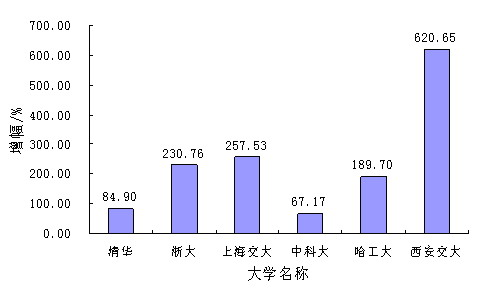
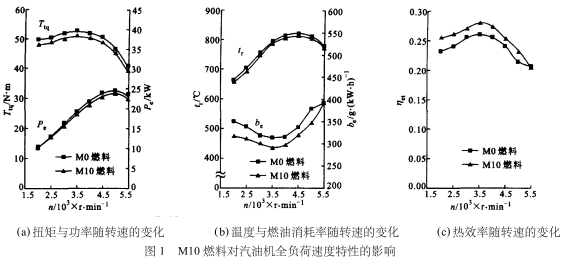

# 新疆大学本科毕业论文（设计）范例复刻

## 封面信息

论文题目：丝绸之路……

……

学生姓名：张强

学号：20222021666

所属院系：经济与管理学院

专业：国际贸易

班级：国贸2022-1

指导教师：李思

日期：年   月   日

---

## 声明

本人郑重声明，本论文是在导师的指导下独立完成，除加注和致谢外，文中不包含他人所发表或撰写的成果。本人拥有自主知识产权，没有抄袭、剽窃他人成果，对于参考的文献已经加注并表示感谢。若有不实之处，本人愿意承担相关法律责任。

作者签名：__________

签字日期：__________

---

## 任务书

自动补全：否

届：……

学院：

班级：

姓名：

毕业论文（设计）题目：

工作开始日期：年   月   日

工作结束日期：年   月   日

目的及意义：

主要工作任务：

指导教师：

教研室主任：

学生签名：

接受任务日期：

---

## 摘要

论文的高度概括，是全文的缩影，是长篇论文不可缺少的组成部分。要求用中、英文分别书写，一篇摘要不少于400字符。

居中编排“摘要”二字（三号黑体），二字间距为两个字符。“摘要”二字下为摘要正文，每段开头空两字符，小四号宋体，行距1.5倍。

关键词：XXX；XXX；XXX；XXX；XXX

摘要正文内容下，空一行，左对齐，打印“**关 键 词**”三字（小四号宋体加粗）三个字中间空一字符，后接冒号，其后为关键词（小四号宋体）。关键词由3～5个组成，每一关键词之间用分号隔开，最后一个关键词后无标点符号。

若摘要内容超出一页，都单面编排打印。

---

## ABSTRACT

英文摘要的内容、格式和字号必须与中文摘要的一致。

居中编排“ABSTRACT”（三号Times New Roman），英文摘要内容用小四号Times New Roman，1.5倍行距。摘要正文每段开头空两个字符。

The key parts in drip irrigation facilities are emitters. The structural design parameters of emitters can directly affect its performance and the function of the whole drip irrigation system ……

Because……

Only ……

To support ……

KEY WORDS: Xxxx; Xxxx; Xxxx; Xxxx

英文摘要正文内容下，空一行，左对齐，打印大写的“**KEY WORDS**”（小\
四号Times New Roman加粗），后接冒号，其后每个关键词组的第一个字母大\
写，其余为小写，关键词由3～5个组成（小四号Times New Roman），每一关键词之间用分号隔开，最后一个关键词后无标点符号。例如：Drip irrigation emitter; RP&M; Hydraulics; Labyrinth flow channel

---

## 目录

1 绪论

2 XX（标题1）

3 XXX（标题1）

4 XXXX（标题1）

5 XXXXX（标题1）

6 XXXXXX（标题1）

7 XXXXXX（标题1）

8 XXXXXXXX（标题1）

9 结论与展望

参考文献

致谢

附录

---

# 1 绪论

绪论：绪论相当于论文的开头，它是三段式论文的第一段（后二段是本论和结论）。绪论与摘要写法不完全相同，摘要要写得高度概括、简略，绪论可以稍加具体一些，文字以1000字左右为宜。绪论一般应包括以下几个内容：

一、为什么要写这篇论文，要解决什么问题，主要观点是什么。

二、对本论文研究主题范围内已有文献的评述（包括与课题相关的历史的回顾，资料来源、性质及运用情况等）。

三、说明本论文所要解决的问题，所采用的研究手段、方式、方法。明确研究工作的界限和规模。

四、概括论文的主要工作内容。

## 1.1 标题2

### 1.1.1 标题3

（1）标题4

①标题5

A.标题6

（A）标题6

a.标题7

标题7

人文社科类论文可以采用中文大写类标题编号。

图、表、公式等一律用阿拉伯数字分章连续编号，如 图1-1、表1-1、公式（1-1）等。

图应有图题，表应有表题，并分别置于图号和表号之后，图号和图题应置于图下方的居中位置，表号和表题应置于表上方的居中位置。引用图或表应在图题或表题右上角标出文献来源。

若图或表中有附注，采用英文小写字母顺序编号，附注写在图或表的下方。

图：

---

（1）插图须紧跟文述。在正文中，一般应先见图号及图的内容后再见图，一般情况下不能提前见图，特殊情况须延后的插图不应跨节。

<!-- thesis-p: style=none line=360 first_line=472 first_line_chars=200 size=24 size_cs=false char_spacing=-2 -->
（2）提供照片应大小适宜，主题明确，层次清楚，金相照片一定要有比例尺。

（3）图应具有“自明性”，即只看图、图题和图例，不阅读正文，就可理解图意。

通常使用的函数图采用简化形式，称为简写函数图。

图中的标目是说明坐标轴物理意义的项目，它是由物理量的符号或名称和相应的单位组成。物理量的符号由斜体字母标注，单位的符号使用正体字母标注，量与单位间用斜线隔开。例如：I/A，ρ/kg·m{{sup:-3 }}，F/N，υ/m·s{{sup:-1  }}等等。

（4）图中用字为宋体五号，如排列过密，用五号字有困难时，可小于五号字，但不得小于七号字。

{width_emu=4942840 height_emu=2432685 p_style=af9 align=none line=360 before=120 after=120 keep_next=false}

<!-- thesis-p: style=af9 align=none line=360 before=120 after=120 indent=none bold=true bold_cs=true keep_next=false mark_kern=0 -->
图1-1 2005年相对2001年，5所大学SCI-e文献总数增幅图

（5）一篇论文中，图的大小适中，同类图片的大小应该一致，编排美观、整齐。

（6）一幅图如有若干幅分图，均应编分图号，用(a)，(b)，(c), ...... 按顺序编\
排；且各分图的分题注直接列在各自分图的正下方，总题注列在所有分图的下方\
正中，如下图所示：

{width_emu=5270500 height_emu=2251710 crop_bottom=7802 line=360 after=18 mark_style=af5 keep_next=false}

<!-- thesis-p: style=none align=center line=360 indent=none run_style=af5 bold=true bold_cs=true mark_style=af5 mark_bold=true mark_bold_cs=true -->
图1-2  M10燃料对汽油机全负荷速度特性的影响

表：

（1）如某个表需要转页接排，在随后的各页上应重复表的编号。编号后跟\
表题（可省略）和“（续）”，如表1（续），续表均应重复表头和关于单位的\
陈述。

表格的设计应紧跟文述。表的编排一般是内容和测试项目由左至右横读，数据依序竖读，应有自明性。若为大表或作为工具使用的表格，可作为附表在附录中给出，论文中的表格参数应标明量和单位的符号。

（2）表中各物理量及量纲均按国际标准(SI) 及国家规定的法定符号和法定\
计量单位标注。

（3）一律使用三线表，与文字齐宽，顶线和底线线粗1.5磅，中线线粗1磅。表格内容1.5倍行距，段前0行，段后空0行。例如表1-1。

（4）使用他人表格须注明出处。

（5）表中用字为宋体五号。如排列过密，用五号字有困难时，可小于五号字，但不小于七号。

（6）表格必须通栏，即表格宽度与正文版面平齐，如下表所示。

::: table {caption="表1-1 文献类型和标志代码" width=5000 width_type=pct widths=2079,2078,2078,2078 cell_width_type=pct cell_widths=1250,1250,1250,1250 top_border=12 bottom_border=12 header_rows=1 header_bold=false row_heights=358,357,357,357,357,357 repeat_header_rows=6 cell_style=none font_size=inherit paragraph_after=omit paragraph_first_line=420 row_top_borders=nil,12,8,nil,nil,nil row_bottom_borders=12,8,nil,nil,nil,12}
| 文献类型 | 标志代码 | 文献类型 | 标志代码 |
| 普通图书 | M | 会议录 | C |
| 汇编 | G | 报纸 | N |
| 期刊 | J | 学位论文 | D {first_line=480} |
| 报告 | R | 标准 | S |
:::

---

<!-- thesis-p: style=none align=center line=360 indent=none bold=true bold_cs=true keep_next=false mark_bold=true mark_bold_cs=true mark_size=24 -->
表1-1 文献类型和标志代码（续）

::: table {width=8529 width_type=dxa widths=2132,2132,2132,2133 top_border=12 bottom_border=12 header_rows=1 header_bold=false row_heights=358,373,373 repeat_header_rows=0 cell_style=none font_size=inherit paragraph_after=omit paragraph_first_line=420 row_top_borders=12,8,none row_bottom_borders=8,none,12}
| 文献类型 | 标志代码 | 文献类型 | 标志代码 |
| 专利 | P | 数据库 | DB |
| 计算机程序 | CP | 电子公告 | EB |
:::

<!-- thesis-p: style=none line=360 first_line=482 size=24 size_cs=false bold_cs=true -->
在三线表中可以加辅助线，以适应较复杂表格的需要，如表1-2所示。

<!-- thesis-p: style=af9 align=none line=240 before=120 after=120 indent=none bold=true bold_cs=true keep_next=false -->
表1-2 方弯管内流动最大速度比较

::: table {width=8529 width_type=dxa widths=2251,1546,1548,1547,1637 top_border=18 bottom_border=18 header_top_border_size=12 header_rows=2 header_bold=false header_bold_cs=true body_bold_cs=true rowspan_restart_bottom_border=false row_heights=324,352,395,395,395 repeat_header_rows=0 cant_split_rows=1,2 cell_style=none font_size=inherit paragraph_after=omit paragraph_first_line=420 row_top_borders=12,8,8,nil,nil row_bottom_borders=8,8,nil,nil,12}
| 项目 {rowspan=2 left=44 continue_left=44 continue_first_line=1764 continue_first_line_chars=840} | 层流 {colspan=2} | 紊流 {colspan=2} |
| 0{{sym:Times New Roman:0000}}截面 {bold_cs=false} | 90{{sym:Times New Roman:0000}}截面 | 0{{sym:Times New Roman:0000}}截面 {bold_cs=false} | 90{{sym:Times New Roman:0000}}截面 |
| 理论值*V{{sub:max}}*/m·s{{sup:-1}} | 0.04 {style=10 font_size=21 font_size_cs=false first_line=omit} | 0.03 | 1.30 | 1.25 |
| 计算值*V{{sub:max}}*/m·s{{sup:-1}} | 0.04 {first_line=omit} | 0.03 | 1.26 | 1.21 |
| 误差/% {left=44} | 0.00 {first_line=omit} | 3.12 | 3.07 | 3.20 |
:::

<!-- thesis-blank: style=none line=360 first_line=482 mark_bold=true mark_size=24 -->

公式：

（1）公式应另起一行，居中编排，较长的公式尽可能在等号后换行，或者\
在“+”、“-”等符号后换行。公式中分数线的横线，长短要分清，主要的横线应\
与等号取平。

（2）公式后应注明编号，公式号应置于小括号中，如公式（1-1）。写在右边行末，中间不加虚线。

（3）公式下面的“式中：”单独占一行且顶格书写。公式中所要解释的符号\
按先左后右，先上后下顺序分行空两个字排，再用破折号与释文连接，回行时与\
上一行释文对齐。上下行的破折号对齐。

（4）公式中各物理量及量纲均按国际标准（SI）及国家规定的法定符号和法定计量单位标注，禁止使用已废弃的符号和计量单位。

范例：

$$ {image=img/formula-1-1.wmf image_alt="公式 1-1" width_emu=750570 height_emu=284480}
q = k_d H^x
$$

<!-- thesis-p: style=none line=360 indent=none size=24 size_cs=false font_ascii=none font_hansi=none font_eastasia=none mark_size=24 -->
式中：

<!-- thesis-p: style=none line=360 first_line=480 size=24 size_cs=false italic_cs=false font_ascii=none font_hansi=none font_eastasia=none mark_size=24 -->
*q* —— 灌水器流量/L·h-1；

<!-- thesis-p: style=none line=360 first_line=480 size=24 size_cs=false italic_cs=false font_ascii=none font_hansi=none font_eastasia=none mark_size=24 -->
*k{{sub:d}}* —— 流量系数；

<!-- thesis-p: style=none line=360 first_line=480 size=24 size_cs=false italic_cs=false font_ascii=none font_hansi=none font_eastasia=none mark_size=24 -->
*H* —— 工作压力/ｍ；

<!-- thesis-p: style=none line=360 first_line=480 size=24 size_cs=false italic_cs=false font_ascii=none font_hansi=none font_eastasia=none mark_size=24 -->
*x* —— 流态指数。

（1-1）中，………………

$$
b^2 - 4ac = \frac{-b \pm \sqrt{b^2-4ac}}{2a}\frac{n!}{r!(n-r)!}\frac{-b \pm \sqrt{b^2-4ac}}{2a}
$$

---

# 2 XX（标题1）

## 2.1 标题2

### 2.1.1 标题3

<!-- thesis-blank: count=4 line=360 first_line=480 -->

公式按章重新编号：

$$
\frac{n!}{r!(n-r)!}\frac{1}{2}
$$

<!-- thesis-blank: count=4 line=360 first_line=480 -->

公式（2-1）说明，…………（公式在正文中的引用）

<!-- thesis-blank: count=5 line=360 first_line=480 -->
<!-- thesis-blank: line=270 first_line=480 -->

图题注：

<!-- thesis-blank: line=360 first_line=480 -->

图2-1 XXXXXX

---

# 3 XXX（标题1）

## 3.1 标题2

### 3.1.1 标题3

<!-- thesis-blank: count=4 line=360 first_line=480 -->

公式按章重新编号：

$$
\frac{n!}{r!(n-r)!}\frac{1}{2}
$$

<!-- thesis-blank: count=4 line=360 first_line=480 -->

公式（3-1）说明，…………（公式在正文中的引用）

<!-- thesis-blank: count=5 line=360 first_line=480 -->
<!-- thesis-blank: line=270 first_line=480 -->

图题注：

<!-- thesis-blank: line=360 first_line=480 -->

图3-1 XXXXXX

---

# 4 XXXX（标题1）

## 4.1 标题2

### 4.1.1 标题3

<!-- thesis-blank: count=4 line=360 first_line=480 -->

公式按章重新编号：

$$
\frac{n!}{r!(n-r)!}\frac{1}{2}
$$

<!-- thesis-blank: count=4 line=360 first_line=480 -->

公式（4-1）说明，…………（公式在正文中的引用）

<!-- thesis-blank: count=5 line=360 first_line=480 -->
<!-- thesis-blank: line=270 first_line=480 -->

图题注：

<!-- thesis-blank: line=360 first_line=480 -->

图4-1 XXXXXX

---

# 5 XXXXX（标题1）

## 5.1 标题2

### 5.1.1 标题3

<!-- thesis-blank: count=4 line=360 first_line=480 -->

公式按章重新编号：

$$
\frac{n!}{r!(n-r)!}\frac{1}{2}
$$

<!-- thesis-blank: count=4 line=360 first_line=480 -->

公式（5-1）说明，…………（公式在正文中的引用）

<!-- thesis-blank: count=5 line=360 first_line=480 -->
<!-- thesis-blank: line=270 first_line=480 -->

图题注：

<!-- thesis-blank: line=360 first_line=480 -->

图5-1 XXXXXX

---

# 6 XXXXXX（标题1）

## 6.1 标题2

### 6.1.1 标题3

<!-- thesis-blank: count=4 line=360 first_line=480 -->

公式按章重新编号：

$$
\frac{n!}{r!(n-r)!}\frac{1}{2}
$$

<!-- thesis-blank: count=4 line=360 first_line=480 -->

公式（6-1）说明，…………（公式在正文中的引用）

<!-- thesis-blank: count=5 line=360 first_line=480 -->
<!-- thesis-blank: line=270 first_line=480 -->

图题注：

<!-- thesis-blank: line=360 first_line=480 -->

图6-1 XXXXXX

---

# 7 XXXXXX（标题1）

## 7.1 标题2

### 7.1.1 标题3

<!-- thesis-blank: count=4 line=360 first_line=480 -->

公式按章重新编号：

$$
\frac{n!}{r!(n-r)!}\frac{1}{2}
$$

<!-- thesis-blank: count=4 line=360 first_line=480 -->

公式（7-1）说明，…………（公式在正文中的引用）

<!-- thesis-blank: count=5 line=360 first_line=480 -->
<!-- thesis-blank: line=270 first_line=480 -->

图题注：

<!-- thesis-blank: line=360 first_line=480 -->

图7-1 XXXXXX

---

# 8 XXXXXXXX（标题1）

## 8.1 标题2

### 8.1.1 标题3

<!-- thesis-blank: count=4 line=360 first_line=480 -->

公式按章重新编号：

$$
\frac{n!}{r!(n-r)!}\frac{1}{2}
$$

<!-- thesis-blank: count=4 line=360 first_line=480 -->

公式（8-1）说明，…………（公式在正文中的引用）

<!-- thesis-blank: count=5 line=360 first_line=480 -->
<!-- thesis-blank: line=270 first_line=480 -->

图题注：

<!-- thesis-blank: line=360 first_line=480 -->

图8-1 XXXXXX

---

# 9 结论与展望

结论与展望：结论包括对整个研究工作进行归纳和综合而得出的总结；所得结果与已有结果的比较；联系实际结果，指出它的学术意义或应用价值和在实际中推广应用的可能性；在本课题研究中尚存在的问题，对进一步开展研究的见解与建议。结论集中反映作者的研究成果，表达作者对所研究课题的见解和主张，是全文的思想精髓，是全文的思想体现，一般应写得概括、篇幅较短。撰写时应注意下列事项：

● 结论要简单、明确。在措辞上应严密，但又容易被人领会。

● 结论应反映个人的研究工作，属于前人和他人已有过的结论可少提。

● 要实事求是地介绍自己研究的结果，切忌言过其实，在无充分把握时，应留有余地。

## 9.1 标题2

### 9.1.1 标题3

<!-- thesis-blank: count=3 line=360 first_line=480 -->

公式按章重新编号：

$$
\frac{n!}{r!(n-r)!}\frac{1}{2}
$$

<!-- thesis-blank: line=360 first_line=480 -->
<!-- thesis-blank: line=270 first_line=480 -->

公式（9-1）说明，…………（公式在正文中的引用）

<!-- thesis-blank: count=2 line=360 first_line=480 -->

图题注：

图9-1 XXXXXX

---

# 参考文献

文后著录的参考文献务必实事求是。论文中引用过的文献必须著录，未引用的文献不得出现。应遵循学术道德规范，避免涉嫌抄袭、剽窃等学术不端行为。

参考文献一般应是作者亲自考察过的对学位论文有参考价值的文献，除特殊情况外，一般不应间接引用。

参考文献应有权威性，要注意引用最新的文献。

参考文献的数量：

一般应在10篇以上，其中，期刊文献不少于8篇，外文文献不少于2篇，原则上均以近5年的文献为主。

参考文献的著录格式应符合国家标准GB/T 7714-2005《文后参考文献著录规则》。参考文献中每条项目应齐全。

<!-- thesis-p: before_lines=50 before=120 line=360 first_line=480 first_line_chars=200 -->
文献中的作者不超过三位时全部列出，超过三位时，一般只列前三位，中文的后面加 “等”字，英文的后面加 “et al”，作者姓名之间用逗号分开。

外国人名一般采用姓在前，名在后的著录法，姓全写且第一个字母大写，名简写成单个大写字母且不加标点，姓和名之间空1格，如：“Metcalf SW”。也可采用名在前，姓在后的著录法，姓全写且第一个字母大写，名简写成单个大写字母且不加标点，名和姓之间空1格，如：“SW Metcalf”。

中文人名的英文表达方式：

简写时，采用姓在前，名在后的著录法，姓全写且第一个字母大写，名简写成单个大写字母且不加标点，如，“林基路”，简写为“Lin JL ”。

全拼时，名在前，姓在后的著录法，名的第一个字母大写，名连写，名后空1格写姓，姓的第一个字母大写。如，“林基路”，写为“Jilu Lin”。

文后参考文献著录格式范例样板，采用五号。

文后参考文献表列示的参考文献的序号及出处等信息应与文中的标注形成一一对应的关系。文献的编号按在文中引用的先后顺序用阿拉伯数字外加方括号[]，如[5]的方式列出。所列文献的编号均左起顶格编排，编号后空一格接文献的作者、题目、期刊名等内容，换行时，左起的文字与前行的文字对齐。

具体要求如下：

A 专著（包括普通图书［M］、论文集和会议录［C］、科技报告［R］、学位论文［D］、标准［S］）

主要责任者．文献题名［文献类型标志］．其他责任者．版本项(第１版不标注) ．出版地：出版者，出版年：引文页码．获取和访问路径．

B 专著中的析出文献

析出文献主要责任者．析出文献题名[文献类型标志]．析出文献其他责任者//专著主要责任者．专著题名：其他题名信息. 版本项(第１版不标注) ．出版地：出版者，出版年：析出文献的起止页码．获取和访问路径．

C 连续出版物

主要责任者．题名:其他题名信息［文献类型标志］．年，卷（期）－年，卷（期）.出版地：出版者，出版年．获取和访问路径．

D 连续出版物中的析出文献（包括期刊中析出的文献[J]、报纸中析出的文献[N].）

析出文献主要责任者．析出文献题名［文献类型标志］．连续出版物题名：其他题名信息，年，卷（期）：页码．获取和访问路径．

E 专利文献

专利发明者/专利申请者或所有者．专利题名: 专利国别,专利号［文献类型标志］.公告日期或公开日期. 获取和访问路径．

F 电子文献（包括专著或连续出版物中析出的电子文献）

主要责任者．题名：其他题名信息[文献类型标志/载体类型标志]．出版地：出版者，出版年（更新或修改日期）．获取和访问路径．

表2-2 文献类型和标志代码

::: table {width=8738 width_type=dxa widths=2184,2184,2185,2185 top_border=12 bottom_border=12 header_rows=1 header_bold=false row_heights=358,358,358,358,358,373,373 repeat_header_rows=0 cell_style=none font_size=inherit paragraph_after=omit paragraph_first_line=420 row_top_borders=12,8,nil,none,none,none,none row_bottom_borders=8,nil,none,none,none,none,12}
| 文献类型 | 标志代码 | 文献类型 | 标志代码 |
| 普通图书 | M | 会议录 | C |
| 汇编 | G | 报纸 | N |
| 期刊 | J | 学位论文 | D {first_line=480} |
| 报告 | R | 标准 | S |
| 专利 | P | 数据库 | DB |
| 计算机程序 | CP | 电子公告 | EB |
:::

表2-3 电子文献载体和标志代码

::: table {width=8738 width_type=dxa widths=2935,1433,2185,2185 top_border=4 bottom_border=4 header_top_border_size=12 header_rows=1 header_bold=false row_heights=343,343,358 repeat_header_rows=0 cell_style=none font_size=inherit paragraph_after=omit row_top_borders=12,8,nil row_bottom_borders=8,nil,12}
| 载体类型 | 标志代码 | 载体类型 | 标志代码 |
| 磁带（magnetic tape） | MT | 磁盘（disk） | DK |
| 光盘（CD-ROM） | CD | 联机网络（online） | OL |
:::

<!-- thesis-blank: line=360 -->

样例：

[1] 刘国钧，郑如斯．中国书的故事［M］．北京：中国青年出版社，1979：110-115．

[2] 昂温 G．外国出版史［M］．陈生铮译．北京：中国书籍出版社，1988．

[3] 辛希孟．信息技术与信息服务国际研讨会论文集：A集［C］．北京：中国社会科学出版社，1979．

[4] 冯西桥．核反应堆压力容器的LBB分析［R］．北京：核能技术设计研究院，1997．

[5] 张和生．地质力学系统理论［D］．太原：太原理工大学，1998．

[6] 全国文献工作标准化技术委员会第七分委员会．GB/T 5795-1986．中国标准书号［S］．北京：中国标准出版社，1986．

[7] 罗云．安全科学理论体系的发展及趋势探讨［M］//白春华，何学秋，吴宗之．21世纪安全科学与技术的发展趋势．北京：科学出版社，2000：1-5．

[8] 钟文发．非线性规划在可燃毒物配置中的应用［C］//赵玮．运筹学的理论与应用：中国运筹学会第五届大会论文集．西安：西安电子科技大学出版社，1996：468－471．

[9] 高义民，张凤华，邢建东等．颗粒增强不锈钢基复合材料冲蚀磨损性能研究［J］．西安交通大学学报，2001，35（7）：727-730．

[10] Papworth A, Fox P, Zeng GT, et al. Ability of aluminum alloy to wet alumina fibres by addition of bismuth[J]. Mater Sci & Technol, 1999, 15(4): 419-428.

[11] 姜锡洲．3一种温热外敷药制备方案：中国，881056078［P］．1989-07-26．

[12] Koseki A, Momose H, Kawahito M, et al. Complier: US, 828402[P/OL].2002-05-25 [2002-05-28]. http://FF&p.

[13] Online Computer Library Center, Inc. History of OCLC[EB/OL]. [2000-01-08]. http://www.clc.org/ about/history/default.htm.

[14] 江向东．互联网环境下的信息处理与图书管理系统解决方案［J/OL］．情报学报，1999，18(2): 4[2000-01-18].http://www.chinainfo.gov.cn/periodical/qbxb．

[15] Scitor C. Project scheduler[CP/DK]. Sunnyvale, Calif. : Scitor Corp, 1983.

[16] Metcalf SW. The Tort Hall air emission study[C/OL]//The International Congress on Hazardous Waste, MarquisHotel, Atlanta, Georgia, June 5-8, 1995: impact on human and ecological health[1998-09-22]. http://atsdrl.atsdr.cdc.gov:8080/cong95.html.

<!-- thesis-blank -->

参考文献里面标点符号：英文文献用半角,中文文献用全角。

---

# 致谢

致谢：对于毕业论文（设计）的指导教师，对毕业论文（设计）提过有益的建议或给予过帮助的同学、同事与集体，都应在论文的结尾部分书面致谢，言辞应恳切、实事求是。应注明受何种基金支持（没有可不写）。

---

# 附录

附录二字中间空两个字符，居中，三号宋体，单倍行距，段前空3行，段后空2行。

附录编号依次编为附录1，附录2。附录标题各占一行，按一级标题编排。每一个附录一般应另起一页编排，如果有多个较短的附录，也可接排。附录中的图表公式另行编排序号，与正文分开，编号前加“附录1-”字样。

<!-- thesis-blank: count=4 line=414 -->

本部分内容非强制性要求，如果论文中没有附录，可以省略《附录》。
